<div align="center">

<!-- ═══════════════════════════ ANIMATED BANNER ═══════════════════════════ -->
[](https://github.com/AsrafujjamanDeepu)

<!-- ═══════════════════════════ TYPING ANIMATION ═══════════════════════════ -->
[](https://git.io/typing-svg)

<!-- ═══════════════════════════ BADGES ROW ═══════════════════════════ -->

[](https://github.com/AsrafujjamanDeepu?tab=followers)
[](https://github.com/AsrafujjamanDeepu)
[](https://asrafujjaman.vercel.app)

</div>

---

## 🧠 About Me

```csharp
namespace AsrafujjamanDeepu
{
    public class Developer
    {
        public string   Name       { get; } = "Asrafujjaman";
        public string   Alias      { get; } = "Deepu";
        public string   Location   { get; } = "📍 Dhaka, Bangladesh";
        public string   Email      { get; } = "asrafujjamandeepu@gmail.com";
        public string   Phone      { get; } = "+8801521200643";
        public string   Website    { get; } = "https://asrafujjaman.vercel.app";

        public string[] Education  { get; } = {
            "🏛️  IsDB IT Scholarship — Cross Platform ASP.NET with C#",
            "🎓  Stanford University — Code in Place (Python)",
            "🔬  B.Sc & M.Sc in Physics"
        };

        public string[] Experience { get; } = {
            "💼  FullStack Software Developer Intern @ Daffodil International Academy",
            "🛠️  Trainee @ IsDB-BISEW IT Scholarship Program"
        };

        public string[] CurrentFocus { get; } = {
            "ASP.NET Core & C# Engineering",
            "Full-Stack Web Applications",
            "Database Architecture (SQL + NoSQL)"
        };

        public string[] Hobbies { get; } = {
            "📖 Reading", "✍️ Writing", "💻 Coding",
            "📷 Photography", "✈️ Travelling"
        };

        public string LifePhilosophy => "Talent is common. Obsession is rare. 🔥";
    }
}
```

---

## 🛠️ Tech Stack & Expertise

<div align="center">

### 💻 Languages
[](https://learn.microsoft.com/en-us/dotnet/csharp/)
[](https://developer.mozilla.org/en-US/docs/Web/JavaScript)
[](https://www.typescriptlang.org/)
[](https://www.python.org/)
[](https://en.cppreference.com/w/c)
[](https://en.wikipedia.org/wiki/SQL)

### 🌐 Frontend
[](https://developer.mozilla.org/en-US/docs/Web/HTML)
[](https://developer.mozilla.org/en-US/docs/Web/CSS)
[](https://getbootstrap.com/)
[](https://tailwindcss.com/)
[](https://angular.dev/)
[](https://react.dev/)
[](https://nextjs.org/)
[](https://dotnet.microsoft.com/en-us/apps/aspnet/web-apps/blazor)
[](https://dotnet.microsoft.com/en-us/apps/maui)
[](https://learn.microsoft.com/en-us/aspnet/core/razor-pages/)

### ⚙️ Backend & Frameworks
[](https://dotnet.microsoft.com/en-us/apps/aspnet)
[](https://learn.microsoft.com/en-us/aspnet/mvc/overview/getting-started/introduction/getting-started)
[](https://learn.microsoft.com/en-us/aspnet/web-api/)
[](https://learn.microsoft.com/en-us/ef/core/)
[](https://learn.microsoft.com/en-us/dotnet/framework/data/adonet/)
[](https://nodejs.org/)
[](https://expressjs.com/)

### 🔗 Web Technologies
[](https://developer.mozilla.org/en-US/docs/Glossary/REST)
[](https://developer.mozilla.org/en-US/docs/Web/Guide/AJAX)
[](https://jquery.com/)
[](https://developer.mozilla.org/en-US/docs/Web/API/WebSockets_API)
[](https://learn.microsoft.com/en-us/aspnet/core/signalr/introduction)
[](https://www.w3.org/XML/)
[](https://www.json.org/)

### 🗄️ Databases
[](https://www.microsoft.com/en-us/sql-server)
[](https://www.mysql.com/)
[](https://www.mongodb.com/)

### 🧰 Tools & IDEs
[](https://git-scm.com/)
[](https://github.com/)
[](https://code.visualstudio.com/)
[](https://visualstudio.microsoft.com/)
[](https://swagger.io/)
[](https://www.postman.com/)
[](https://www.docker.com/)
[](https://www.sap.com/products/technology-platform/crystal-reports.html)

</div>

---

## 💼 Experience

<table>
<tr>
<td width="50%" valign="top">

### 🏢 FullStack Software Developer Intern
**[Daffodil International Academy](https://daffodil.ac/site/)** · *Nov 2025 – Oct 2026*
> One-year internship architecting and deploying web application solutions across three distinct stacks — MEAN, MERN, and .NET Full-Stack Development.

</td>
<td width="50%" valign="top">

### 🎓 Trainee — IT Scholarship Program
**[IsDB-BISEW IT Scholarship Program](https://www.isdb-bisew.org/)** · *Nov 2025 – Oct 2026*
> Served as Class Representative during an intensive 8.5-month (788-hour) training program mastering cross-platform application development with ASP.NET, Angular, and React.

</td>
</tr>
</table>

---

## 🚀 Featured Projects

<p align="center">
  <a href="https://github.com/AsrafujjamanDeepu/TicketPortal">
    
  </a>
  <a href="https://github.com/AsrafujjamanDeepu/ActiveArch">
    
  </a>
</p>
<p align="center">
  <a href="https://github.com/AsrafujjamanDeepu/AssignmentSubmissionSystem">
    
  </a>
  <a href="https://github.com/AsrafujjamanDeepu/Study_Tracker_Python">
    
  </a>
</p>

### 🔨 Also Built
| Project | Stack | Description |
|---|---|---|
| 🏥 **[Clinic Management System](https://github.com/AsrafujjamanDeepu/ClinicManagementSystem)** | ASP.NET Core · Entity Framework Core · SQL Server · Razor View Engine | Patient-appointment management system for clinic operations |
| 🎓 **[Student Management System](https://github.com/AsrafujjamanDeepu/StudentManagementSystem)** | ASP.NET MVC · Entity Framework · SQL Server · Razor View Engine | Student management system with a clean, data-driven Razor UI |
| 🛒 **[Virtual Mart](https://github.com/AsrafujjamanDeepu/VirtualMart)** | JavaScript · jQuery · Node.js · WebSocket · MongoDB · HTML · CSS · Bootstrap | Full-stack e-commerce platform with secure user authentication |
| 🖥️ **[Courier Service](https://github.com/AsrafujjamanDeepu/CourierService)** | C# · SQL Server · ADO.NET · SAP Crystal Reports | Windows Forms application to automate courier service management |
| 🎬 **[Advanced Media Streaming Management System](https://github.com/AsrafujjamanDeepu/Advanced_Media_Streaming_Management_MSSQL)** | SQL Server · T-SQL · Advanced DDL & DML | Optimized SQL Server system with stored procedures and triggers |

---

## 📊 GitHub Analytics

<div align="center">




<br/>




</div>

---

## 🏆 GitHub Trophies

<div align="center">

[](https://github.com/ryo-ma/github-profile-trophy)

</div>

---

## 🎓 Education & Certifications

<div align="center">

| 🏛️ Institution | 📚 Programme | 🏅 Highlight |
|---|---|---|
| **[IsDB-BISEW](https://isdb-bisew.org/)** | Cross Platform ASP.NET with C# | IT Scholarship Graduate |
| **[Stanford University](https://codeinplace.stanford.edu/)** | Code in Place | Python Programming |
| **[Govt. Bangla College](https://www.sarkaribanglacollege.gov.bd/)** (Dhaka University) | M.Sc in Physics | 2022 – 2023 |
| **[Govt. Bangla College](https://www.sarkaribanglacollege.gov.bd/)** (Dhaka University) | B.Sc in Physics | 2017 – 2022 |

</div>

---

## 🐍 Contribution Snake

<div align="center">


</div>

---

## 📬 Let's Connect

<div align="center">

[](mailto:asrafujjamandeepu@gmail.com)
[](https://linkedin.com/in/asrafujjaman)
[](https://wa.me/8801521200643)
[](https://asrafujjaman.vercel.app)

</div>

---

<div align="center">

[](https://github.com/AsrafujjamanDeepu)

**✨ "You got all the talent in the world — but are you obsessed? 🔥" ✨**

*Asrafujjaman · Software Engineer · Dhaka, Bangladesh*

</div>
